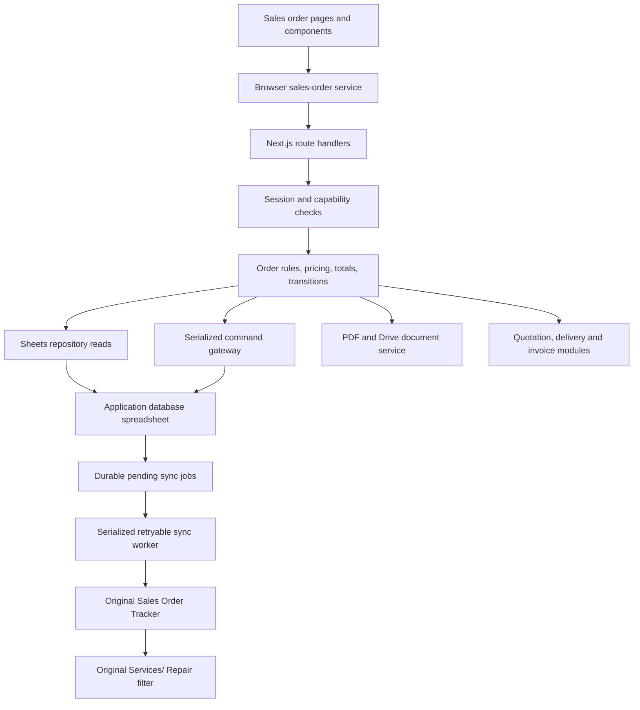

# Sales order implementation plan

Planning baseline: 19 September 2026. Status: proposed design; no application or live workbook changes made. Google Sheets remains the version-one system of record, as requested.

## 1. Recommendation and scope

Build a Sales Orders module in the existing Next.js application, using normalized tabs in the application's configured database spreadsheet. Reuse its customer, product, pricing, quotation, delivery, invoice, user, and Drive capabilities. Preserve the supplied workbook as a legacy source during migration.

Confirmed synchronization direction: **application → user's own spreadsheet (authoritative records) → original Sales Order Tracker (reporting copy)**. New confirmed orders and subsequent changes are copied automatically to the original workbook. Drafts remain in the user's spreadsheet until confirmation. The original Services/ Repair tab continues to derive its rows through its filter; the original Sales Order Entry form is replaced by app entry. The original workbook remains an active reporting destination after migration. This is one-way synchronization; edits in the original workbook do not update application records.

One order has one customer and multiple independently identified lines. Services/Repair is a filtered view of the same orders, initially with service completion tracking; it is not a second order database. Separate order category from product category and line type: a repair order can contain both parts and labor.

Version one includes order entry, drafts, confirmation, assignment, tracking, attachments, printing, partial fulfillment, audit history, and legacy import. Full stock accounting, technician scheduling, procurement automation, and payment collection automation are later increments. Do not advertise live stock availability until a reliable stock source is connected.

## 2. Verified source analysis

Workbook: [SALES ORDER TRACKER](https://docs.google.com/spreadsheets/d/14G57IKQ73FCxjZyba216vZlsbsqPYsgPGsjVKzcyzwY/edit).

| Actual tab | Sheet ID | Observed role |
|---|---:|---|
| Sales Order Entry | 1717530755 | Shared single-item entry form, 25 rows × 9 columns |
| Sales Order Tracker | 994239522 | Line-level transaction register, headers A:W; grid extends to X |
| Services/ Repair | 571577642 | Formula-derived filter of tracker category `Services/ Repair` |
| Client Directory | 0 | Customer lookup used by entry form |
| Product List & Inventory | 1403872864 | Hidden product lookup imported from another workbook |
| PO Response Master | 654076272 | Hidden dependency candidate; contents not inspected |
| Setup | 1386412678 | Hidden category/status setup; sampled only |
| Purchase Request Form | 1206532066 | Hidden dependency candidate; contents not inspected |

Read scope: workbook metadata; full entry form; tracker A1:W998 values; formulas and validations in first seven tracker/service rows; bounded lookup samples and tracker rows 900–910. Apps Script submission logic, triggers, and external inventory/delivery workbooks were not inspected. Grid sizes are not record counts.

The tracker read contains **670 populated item rows and 305 distinct tracker numbers**, ending at row 671. Highest observed tracker number: 1297. No sampled tracker grouping across the full values read has conflicting nonblank customer names or PO references; two tracker groups contain multiple categories. This supports order/line normalization, but is not proof that tracker numbers are globally unique outside this workbook.

| Quality check across populated tracker rows | Count |
|---|---:|
| Missing quantity | 34 |
| Missing unit amount | 207 |
| Missing total amount | 79 |
| Missing SKU | 37 |
| Missing category | 30 |
| Blank imported status T | 125 |
| Blank manual status V | 481 |

Category rows: Consumables 99; Services/ Repair 237; Project 85; Parts 78; Supplies 32; Treatment Package 104; PMS 5; blank 30. These are line counts, not order counts.

Specific findings:

- Entry D8 selects a product; D10 holds category; D12 received date; D14 SKU; D16 client code; D18 customer; D20 customer PO reference; D22 PO link. D5 is tracker number. G5 description; G8 quantity; G11 available quantity display; G12 amount; G14 discount; G16 VAT; G18 net amount; G20 remarks; G22 quotation link.
- Entry G11 looks up product column I, whose observed header is **Price/ Unit**, although the form labels it Available Qty. This must not become the application's stock source.
- Entry D16 derives client code from the selected product, not the selected customer. The application must resolve customer identity independently.
- Entry G18 calculates quantity × amount − discount. G16 extracts VAT using G18 / 1.12 × 0.12. This suggests VAT-inclusive pricing, but finance must confirm treatment and discount meaning before implementation.
- Entry lookups currently show `#N/A` when the product is blank. Handle missing values as validation states.
- Tracker T1 imports a delivery status column by row position from another workbook. Q2 showed `#REF!` during the cell inspection. Formula results can change between reads; do not treat this as a permanent workbook-wide error count.
- Tracker V is a separate manual Completed/Pending dropdown. W ages records based on V, so blank V can keep a delivered order aging.
- Tracker S uses R−Q without clamping. Negative shortages are possible; blanks must not be treated as verified zero stock.
- Services/ Repair A1 filters Tracker A:W. Importing both tabs would duplicate service orders.
- Workbook locale is en_GB and timezone Asia/Shanghai. Use explicit date parsing and Asia/Manila business dates in the app, never ambiguous browser date parsing.

## 3. Existing application fit

Verified in the repository: Next.js 16.2.10, React 19, TypeScript, shadcn/Radix, TanStack Table, googleapis, and React PDF. Data access uses `getDatabaseSpreadsheetId()` and `getSheetsClient()` from `src/lib/googleSheets.ts`. Browser services use `apiClient` with `/api` already configured.

| Existing capability | Reuse / integration |
|---|---|
| `Companies`, `CompanyContacts`, `PaymentTerms` | Customer selection, addresses, contact and terms snapshots |
| `Products`, `ProductCategories`, `ProductUnits` | Stable product references and line snapshots |
| `CustomerPrices` | Effective-date customer prices and customer product names |
| `Quotations`, `QuotationDetails`, `QuotationNotations` | Create an order from a quotation; snapshot selected lines |
| `DeliveryReceipts`, `DeliveryReceiptItems` | Create/link deliveries by order line; keep existing DR workflow |
| `ServiceInvoices`, `ServiceInvoiceItems` | Link commercial documents; an invoice is not proof of service completion |
| `Users`, existing session helpers | Resolve actor server-side and check capabilities |
| `Warehouses` | Warehouse reference only; observed code is not a stock ledger |
| Existing PDF and Drive helpers | Reuse rendering/upload foundations |

Sales Orders currently links to `/dashboard/#` in `src/components/app-sidebar.tsx`. No dedicated sales order implementation was found in the inspected source inventory. Existing DRs have PO/TR/SR text references but no stable sales-order-line link. Add explicit links; do not join records by matching row number or description.

## 4. Workflow and business rules

1. Create blank order or create from quotation.
2. Select customer, site, received date, customer PO reference, payment terms, category and responsible user.
3. Add product or service lines. Pricing preference: selected quotation snapshot, then effective customer price, then default selling price. Show price origin; require a reason/capability for overrides.
4. Save draft with incomplete commercial fields allowed and highlighted.
5. Confirm or cancel after validating required fields, totals, references and permissions. Allocate the display order number at confirmation. Only administrator users may confirm or cancel orders.
6. Fulfill product quantities only from a finalized Delivery Release linked by immutable Sales Order and line IDs; its displayed Sales Order No. replaces the legacy TR# field. Fulfill service quantities only from a finalized Service Report linked to both the Service Invoice and the Sales Order; a Service Invoice alone is not completion evidence.
7. Complete when every active line's required quantity is fulfilled. Invoice/payment state stays separate.
8. Cancel unfulfilled quantities with reason; preserve fulfilled history. Returns/reversals are explicit events and may reopen fulfillment.

Suggested order status: `DRAFT`, `CONFIRMED`, `ON_HOLD`, `CANCELLED`, `CLOSED`. Derived fulfillment: `UNFULFILLED`, `PARTIAL`, `FULFILLED`, `NOT_APPLICABLE`. Track `LEGACY_UNVERIFIED` as migration quality, not as a fabricated delivery state. CLOSED requires fulfilled quantities or an explicit audited administrative close reason.

Categories retain the seven existing options; mixed-category orders derive a Mixed label from their lines. Services view includes an order if any active line has Services/ Repair category, displaying matching lines with access to the complete order.

Use immutable UUIDs for order and line keys. The user-facing label is **Sales Order No.**, with display reference `AIC-SO-YYYY-NNNN` and a sequence independent of Purchase Orders (`AIC-PO-YYYY-NNNN`). The old Tracker No. served as the legacy sales order number and remains separately searchable after migration. Rename the old Sales PO number label to **Customer PO No.**: this is an optional customer-issued reference, saved separately from the internal Sales Order No. Customer PO references are text, preserve leading zeros, and are not globally unique. Warn on repeated nonblank customer + PO, allowing a justified split order. Allow the customer PO document to be attached.

Money rules: server computes all amounts using fixed-point/decimal arithmetic and explicit two-decimal rounding. A Sales Order converted from a quotation copies and preserves that quotation's line prices, discounts, VAT mode, VAT rate, and totals; a customer PO never overrides the quotation snapshot. Surface a PO-versus-quotation discrepancy for review. For the inclusive mode, line payable = quantity × unit price − line discount; VAT portion = payable × rate / (1 + rate); base = payable − VAT. Exclusive mode adds calculated tax; exempt/zero-rated modes remain distinct labels. Direct-order tax mode and discount basis still require the Phase 1 finance decision. Version one uses fixed-amount line discounts; percentage input can convert to a stored amount. Header-wide discounts and shipping require an explicit allocation policy before addition. Sum rounded line amounts for order totals.

Historical missing prices stay unknown, not zero. Imported incomplete records can be viewed, but must be repaired before new confirmation/fulfillment. Confirmed commercial changes require revision history and cannot reduce quantity below already fulfilled quantity.

## 5. Frontend design

| Route | User experience |
|---|---|
| `/dashboard/sales-orders` | Summary cards, paginated tracker, filters, saved views, Create Order |
| `/dashboard/sales-orders/new` | Customer/order information, editable line grid, attachments and totals |
| `/dashboard/sales-orders/[id]` | Summary plus Items, Fulfillment, Documents, Activity sections |
| `/dashboard/sales-orders/[id]/edit` | Draft edits or controlled revision of confirmed orders |
| `/dashboard/sales-orders?view=services` | Same tracker filtered to Services/Repair |

Tracker columns: SO number, legacy tracker, received date, customer, PO reference, category summary, PIC, total, order status, fulfillment progress, age, required date and actions. Expand for line details. Filters: date range, customer, category, PIC, order/fulfillment status, overdue and migration issues. Search SO/legacy tracker/PO/product. Distinguish overdue (required date passed) from age (days since received).

Form sections: customer and delivery site; commercial references; items; attached PO/quotation; summary. Line columns: product/service, customer-facing name, description, unit, quantity, price, discount, tax mode/rate, total. Optional availability is timestamped and marked Unknown when unavailable. Custom services allow no ProductId but require description/unit and service line type.

Support keyboard entry, inline errors, unsaved-change warning, explicit Save Draft, disabled repeated submit, retry feedback, and conflict recovery that preserves local edits. Use responsive item cards on small screens rather than forcing a wide editable grid. Avoid rendering every detail row on initial tracker load.

Detail actions are capability- and state-aware: confirm, hold/resume, assign PIC, create delivery, view linked delivery evidence, print, attach document, cancel remainder. Use the existing Delivery Release page's layout, selectors, dialogs, item-entry behavior, responsive cards, preview, and print workflow as the Sales Order UI baseline; add commercial pricing, discounts, VAT, totals, and quotation snapshots. Show both created delivery documents and verified fulfilled quantity; merely creating a draft DR must not mark goods delivered.

## 6. Backend architecture



Keep route handlers thin. Introduce a server-only order domain layer separate from browser `src/lib/services/*.service.ts` and isolate column mapping in a Sheets repository. Use the installed Next.js local guides before implementation, especially async route parameters/cookies and caching behavior.

Suggested files:

```text
src/types/salesOrder.ts
src/lib/services/sales-order.service.ts          # browser API wrapper
src/lib/salesOrders/domain.ts                   # rules and calculations
src/lib/salesOrders/validation.ts               # runtime request validation
src/lib/salesOrders/repository.ts               # reads and column mapping
src/lib/salesOrders/commands.ts                 # authenticated write gateway client
src/lib/salesOrders/permissions.ts
src/lib/salesOrderPdf.tsx
src/components/sales-orders/{form,item-editor,table,detail,activity}.tsx
src/app/api/sales-orders/.../route.ts
src/app/dashboard/sales-orders/.../page.tsx
scripts/audit-sales-order-import.mjs
scripts/migrate-sales-orders.mjs
apps-script/sales-order-writer/                 # proposed new deployment
```

**Concurrency is a required part of the Sheets design.** A version column followed by a normal Sheets update is not compare-and-swap. A JavaScript mutex inside a Next.js process does not coordinate multiple application instances.

Proposed version-one solution: a small server-to-server Apps Script command gateway, with all new order writes using one script lock. Next.js authenticates the user and signs a constrained command envelope; the gateway verifies signature, timestamp, command ID, allowed operation and configured workbook. Secrets remain server-side/in Script Properties. Never expose a generic arbitrary-range writer. Deployment/authentication compatibility must be proven in the first technical spike.

Inside the lock: check command receipt/idempotency hash, read current order/version and sequence, validate the expected version and invariants, then submit one Sheets `spreadsheets.batchUpdate` containing header, lines, history, sequence, command receipt, and the outbound sync-job row when the mutation affects a confirmed order. Release after commit. Retrying the same command returns the recorded result; same ID with a different payload is rejected. A lock timeout returns retryable busy feedback. Direct edits to canonical tabs are restricted because they bypass the lock. All future stock writers must share the same serialization boundary.

Google documents atomic application of requests within one batch, but that does not make the preceding read atomic or protect against other collaborators. Apps Script locks coordinate cooperating script executions only. See [batchUpdate semantics](https://developers.google.com/workspace/sheets/api/reference/rest/v4/spreadsheets/batchUpdate) and [LockService](https://developers.google.com/apps-script/reference/lock/lock-service).

If the gateway cannot meet deployment requirements, select a durable single-writer service before multiuser release. Do not silently substitute a scan-and-increment sequence. Keep the storage boundary replaceable for a later relational database.

Batch reads, request-level memoization, bounded scans and a short shared-cache policy reduce API traffic. Master lists may be cached; validation/stock decisions require fresh reads under the writer. Google currently documents separate read/write limits of 300 requests/minute/project and 60/minute/user/project. Use bounded exponential backoff for throttling and idempotent write retries. [Sheets usage limits](https://developers.google.com/workspace/sheets/api/limits)

## 7. Proposed Google Sheets schema

Create the following tabs in the workbook returned by `getDatabaseSpreadsheetId()`, after explicitly verifying that target during implementation. It has not been assumed to equal the legacy workbook. Header row 1; data row 2 onward; fixed, versioned header contracts; no merged cells; protected canonical data; no volatile formulas in persisted commercial fields. The lists below define left-to-right column order, starting at A.

Conventions: IDs/references are text; quantities/rates numeric; money columns are numeric currency amounts with two-decimal rounding; business dates are ISO `YYYY-MM-DD`; audit timestamps UTC ISO strings; optional values blank. User text is written as literal strings, never parsed as formulas. UUID keys survive sorting and row changes. No physical deletion of referenced rows.

### Core tabs

**SalesOrders — one row per order**

`SalesOrderId, SalesOrderNo, LegacyTrackerNo, ReceivedDate, CustomerId, CustomerNameSnapshot, CustomerTINSnapshot, BillingAddressSnapshot, ContactId, ContactNameSnapshot, ContactPhoneSnapshot, DeliveryAddressSnapshot, CustomerPONo, QuotationNo, PaymentTermId, PaymentTermsSnapshot, RequiredDate, AssignedToUserId, Currency, OrderStatus, FulfillmentStatus, SubtotalExTax, DiscountTotal, TaxTotal, GrandTotal, Remarks, Version, ConfirmedAt, ClosedAt, CancelReason, ImportQuality, CreatedAt, CreatedBy, UpdatedAt, UpdatedBy`

Required for confirmation: customer, received date, currency, valid active lines, authorized assignee if assignment is mandatory. SO number allocated under lock. Customer PO No. is optional; its absence alone does not block confirmation or constitute a migration error. Amounts and fulfillment are server-controlled cached projections. Category is derived from lines, not a duplicate competing field.

**SalesOrderItems — one row per stable line**

`SalesOrderItemId, SalesOrderId, LineNo, OrderCategory, LineType, ProductId, ProductCodeSnapshot, ProductNameSnapshot, CustomerProductNameSnapshot, Description, UnitId, UnitSnapshot, Quantity, UnitPrice, PriceSource, CustomerProductPriceId, QuotationLineReference, DiscountAmount, TaxMode, TaxRate, SubtotalExTax, TaxAmount, LineTotal, FulfilledQty, CancelledQty, LineStatus, PriceOverrideReason, CreatedAt, CreatedBy, UpdatedAt, UpdatedBy`

LineType: PRODUCT or SERVICE. PRODUCT needs a matched ProductId before operational confirmation; imported unmatched products are quarantined for mapping. SERVICE may omit ProductId. PriceSource: QUOTATION, CUSTOMER_PRICE, DEFAULT_PRICE, MANUAL or LEGACY. Source quotation lines currently lack verified immutable line IDs; add IDs or preserve a conversion snapshot reference rather than relying permanently on row numbers. `SubtotalExTax` means post-discount taxable/base amount; discount total is informational and must not be subtracted a second time.

**SalesOrderHistory — append-only business activity**

`EventId, SalesOrderId, SalesOrderItemId, EventType, FromStatus, ToStatus, ChangedFieldsJson, Reason, CommandId, ActorUserId, CreatedAt`

Record field changes with before/after values and revisions, plus confirmation, assignment, cancellation, fulfillment and document events. Keep bounded event payloads and omit credentials. Sheet protection is an operational safeguard, not tamper-proof audit storage.

**SalesOrderDocuments — references and generation state**

`DocumentId, SalesOrderId, DocumentType, ExternalDocumentNo, DriveFileId, ExternalUrl, FileName, MimeType, OrderVersion, GenerationStatus, ErrorCode, CreatedAt, CreatedBy`

Document types: CUSTOMER_PO, QUOTATION, SALES_ORDER_PDF, SERVICE_REPORT, OTHER. Delivery/invoice references also use the relationship tab below. Validate URL scheme/host and upload size/type, authorize downloads against the parent order, and do not change sharing automatically. Render PDF from an immutable order snapshot, avoiding a shared editable print-template race. Drive upload failure leaves the order saved and document generation retryable; the two systems are not one transaction.

**SalesOrderFulfillments — quantity evidence and reversals**

`FulfillmentId, SalesOrderId, SalesOrderItemId, FulfillmentType, SourceDocumentType, SourceDocumentId, SourceLineId, Quantity, EffectiveDate, EvidenceDriveFileId, ReversesFulfillmentId, Status, CommandId, CreatedAt, CreatedBy`

Types: DELIVERY, SERVICE_COMPLETION, REVERSAL. Store positive magnitude; reversal sign comes from type. Only POSTED evidence counts; drafts do not. Validate customer and line match and prevent fulfillment exceeding ordered minus cancelled quantity. A source event must have a stable unique key. Reverse/cancel downstream documents through reconciliation, not deletion.

**SalesOrderDocumentLinks — downstream document relationships**

`LinkId, SalesOrderId, SalesOrderItemId, DocumentType, DocumentId, DocumentLineId, LinkedQty, LinkStatus, CommandId, CreatedAt, CreatedBy`

Supports multiple DRs/invoices per order and future consolidated documents. Linking an invoice does not increment fulfilled quantity. Introduce immutable item IDs in DR/SI child tabs before relying on their line references; append columns rather than shifting existing positional schemas. Existing DR line numbers and SI descriptions alone are insufficient durable keys. Version-one UI can limit a new DR to a single order while storage supports later expansion.

**SalesOrderSequences — display number allocation**

`SequenceKey, Prefix, BusinessYear, LastNumber, UpdatedAt`

Allocate only under the shared writer lock, in the same batch as confirmation. Define sequence overflow and year rollover behavior. Do not reuse cancelled numbers. Legacy tracker references remain separate.

**SalesOrderCommands — idempotency receipts**

`CommandId, PayloadHash, CommandType, SalesOrderId, ResultVersion, ResultJson, CommittedAt, ActorUserId`

Store the successful receipt in the same batch as the business changes. No success receipt means reconcile/read before retrying after an ambiguous network timeout. Retain receipts for the supported retry lifetime and migration replay window; never prune active migration keys.

**SalesOrderImportMap — migration provenance**

`ImportKey, SourceSpreadsheetId, SourceSheetId, SourceRow, SourceTrackerNo, SourceHash, TargetSalesOrderId, TargetSalesOrderItemId, ImportBatchId, ImportStatus, IssueCodes, ImportedAt`

Freeze/snapshot source first so source row + hash is reproducible. SourceRow is provenance only, never a runtime identity. Keep full original values/formulas in the restricted import snapshot rather than exposing raw source data in UI logs.

**SalesOrderSyncJobs — durable outbound work in the user's spreadsheet**

`SyncJobId, SalesOrderId, OrderVersion, DestinationSpreadsheetId, DestinationSheetId, Status, AttemptCount, NextAttemptAt, LastErrorCode, LastErrorMessage, LeaseToken, LeaseOwner, LeaseExpiresAt, CreatedAt, LastAttemptAt, SyncedAt`

Create a job in the same atomic batch as each relevant confirmed-order mutation. Unique logical key: order ID + version + destination. States: PENDING, PROCESSING, RETRY, SYNCED, FAILED, SUPERSEDED. Claiming occurs inside the gateway lock and assigns a unique LeaseToken, LeaseOwner, and LeaseExpiresAt. Completion or retry must present the active lease token. An expired PROCESSING lease returns to RETRY through the locked recovery path. Store safe operational errors, without credentials or customer document contents. Draft-only saves do not enqueue publishing jobs.

**SalesOrderSyncMap — destination reconciliation in the user's spreadsheet**

`DestinationSpreadsheetId, DestinationSheetId, SalesOrderItemId, SalesOrderId, DestinationRowHint, LastSyncedVersion, LastSyncedHash, LastSyncedAt`

Row hints are only optimizations: locate and verify immutable line keys before updating. Keep mapping separate from import provenance; a destination row can move when users sort. The worker repairs this map after an ambiguous response by reading destination keys and versions.

### Optional inventory increment, after source verification

**InventoryMovements:** `MovementId, ProductId, WarehouseId, MovementType, QuantityDelta, SourceType, SourceId, SourceLineId, EffectiveAt, ReversesMovementId, CommandId, CreatedAt, CreatedBy`.

**StockReservations:** `ReservationId, SalesOrderId, SalesOrderItemId, ProductId, WarehouseId, ReservedQty, ConsumedQty, ReleasedQty, Status, Version, CreatedAt, CreatedBy, UpdatedAt, UpdatedBy`.

On-hand = posted movement deltas. Outstanding reserved = reserved − consumed − released. Available = on-hand − outstanding reservations. For the current order's line, shortage = max(0, remaining demand − its existing reservation − newly allocatable free stock). Never compare full ordered quantity against availability after subtracting that order's own reservation. Physical dispatch consumes stock; reservation does not. Authoritative reservation checks require all stock-changing operations to use the same gateway. This is an additional inventory project, not a quantity field on Products.

### Reporting tabs

Optional `SalesOrderTrackerView` and `ServiceRepairView` in the user's workbook are rebuildable projections, never writable sources. The original Sales Order Tracker is a required reporting projection, maintained by the outbound worker. Display familiar legacy columns plus SO ID and line ID. Show sync status and last successful sync time in the application. Disable manual entry into app-managed original tracker rows after cutover while allowing the worker to update them.

## 8. Exact legacy column mapping

| Source tracker column | Legacy header | Destination / handling |
|---|---|---|
| A | Tracker No. | SalesOrders.LegacyTrackerNo; group candidate within this workbook |
| B | Date Received | SalesOrders.ReceivedDate; convert serial/verified displayed date |
| C | Category | SalesOrderItems.OrderCategory |
| D | Sales PO number | SalesOrders.CustomerPONo, text |
| E | Client name | Resolve Companies.CustomerId; retain name snapshot |
| F | Remarks | Header only if identical; differing line remarks preserved in import history or a new line Remarks field before migration |
| G | SKU | Match Products.ProductCode; retain code snapshot |
| H | Product Name | Product/customer name snapshot; do not overwrite master name |
| I | General Description | Line Description |
| J | Qty | Quantity; blanks remain unknown |
| K | Amount | UnitPrice, supported by entry formula and example totals |
| L | Discount | DiscountAmount; confirm fixed line amount interpretation |
| M | VAT | Historical TaxAmount; retain and reconcile, do not blindly recalculate |
| N | Total Amount | Historical LineTotal; compare against approved rules |
| O | PO | CUSTOMER_PO document reference; extract hyperlink target |
| P | Quotation | QUOTATION document reference; match internal quotation only when verified |
| Q | Actual Inventory | Legacy snapshot only; not an opening stock balance |
| R | Reserved | Legacy snapshot only; reconcile before actual reservation import |
| S | Lacking Qty | Recompute after inventory source verification |
| T | Status (imported) | Preserve raw delivery status; reconcile by document/line ID |
| U | PIC | Resolve Users; unresolved values flagged |
| V | Status (manual) | Preserve raw workflow status; explicit migration rule required |
| W | Time Elapsed | Derived in app; no persisted counter |

Do not silently choose header values when lines disagree. Expand the schema with line remarks if required by the full import audit; preserve every original value in provenance either way. Date, PO, documents, assignee and status differences need the same conflict report as customer grouping.

## 9. API contract

| Method and path | Responsibility |
|---|---|
| GET `/api/sales-orders` | Filtered summary list, stable sorting, page metadata |
| POST `/api/sales-orders` | Create draft, optional quotation conversion |
| GET `/api/sales-orders/[id]` | Header, lines, totals, links, permissions and version |
| PATCH `/api/sales-orders/[id]` | Validated draft/revision edit with expected version |
| POST `/api/sales-orders/[id]/confirm` | Validate and allocate SO number |
| POST `/api/sales-orders/[id]/hold` or `/resume` | Explicit state transition |
| POST `/api/sales-orders/[id]/cancel` | Cancel remaining quantity with reason |
| POST `/api/sales-orders/[id]/fulfillments` | Record/reverse evidence-backed service or delivery fulfillment |
| POST `/api/sales-orders/[id]/deliveries` | Prepare/create linked DR using existing module |
| POST `/api/sales-orders/[id]/documents` | Attach validated document reference/upload |
| POST `/api/sales-orders/[id]/pdf` | Generate/retry PDF for a specified order version |
| GET `/api/sales-orders/[id]/history` | Paginated audit trail |
| GET `/api/sales-orders/options` | Customers, categories, users, units and terms |
| GET `/api/sales-orders/pricing` | Customer/product/business-date price resolution |

Mutation envelope includes command ID and expected version where applicable. Actor, timestamps, calculated amounts and permitted transitions are server-owned. Use runtime schema validation rather than TypeScript casts. Error shape: `{ code, message, fieldErrors?, currentVersion?, retryable? }`. Distinguish 400 malformed input, 401 unauthenticated, 403 forbidden, 404 missing, 409 conflict, 422 business validation and 503 dependency/busy failure.

Suggested permissions: sales creates/edits assigned drafts; sales manager confirms, overrides and cancels; operations fulfills and assigns within scope; finance views totals and links invoices; admin manages setup/import. Map capabilities to actual roles before shipping. Validate every API independently, including object-level access and downloads. Require a production session secret and effective session expiration; the inspected session helper has a development-secret fallback and no embedded expiry validation.

## 10. Integrations and failure handling

### One-way synchronization to the original workbook

Destination spreadsheet ID: `14G57IKQ73FCxjZyba216vZlsbsqPYsgPGsjVKzcyzwY`; tracker sheet ID: `994239522`. Resolve by ID and verify title/schema before writes. The authoritative source is the application database spreadsheet already configured by `GOOGLE_SHEET_ID_DATABASE`, verified distinct from the legacy workbook. Remaining provisioning consists of granting the service identity access and creating the new tabs; no third workbook or new source URL is required. Use separate server-side configuration for the two workbooks; never redirect all existing app modules to a different workbook implicitly.

Save authoritative data first, atomically with its outbound job. Return success with sync state PENDING even if the original workbook is unavailable. A scheduled durable worker processes pending jobs independently of an open browser or a request's lifetime. Select and prove the scheduler mechanism during Phase 1; the one-minute target remains conditional until that proof succeeds.

The transaction boundary has three explicit parts:

1. Source order mutation, command receipt, and outbox job commit atomically in one `batchUpdate` against the application database spreadsheet.
2. Destination publication is a separate idempotent operation executed through the lock gateway.
3. Source acknowledgment is a separate operation reconciled against destination immutable keys, version, and payload hash.

The two workbooks cannot commit as one transaction; never label a pending copy as saved to both workbooks.

The scheduler may discover candidate jobs outside the lock through read-only queries that never change job state. Claiming, lease validation, destination publishing, and final reconciliation must execute through the same Apps Script lock gateway. Before each publish, read the latest authoritative order snapshot and recheck destination version. Older jobs cannot overwrite newer versions; coalesce them as SUPERSEDED when appropriate. Publish all rows for an order and their key/version metadata in one destination batch. Then acknowledge the job and mapping in the source workbook using the active lease token. If acknowledgment fails, retry reads the destination keys/hash/version and finishes acknowledgment without appending duplicates. Use bounded backoff for transient failures; surface permanent permission/schema errors for action and provide an authorized Retry Sync action.

The scheduler and Apps Script gateway are net-new infrastructure. Phase 1 must select the scheduler, prove gateway authentication and timeout behavior, demonstrate overlapping invocations are serialized, and verify expired-lease recovery before implementation proceeds.

Destination column ownership is provisional until Phase 1 inspects the legacy Apps Script, triggers, formulas, and external workbooks:

| Columns | Provisional owner |
|---|---|
| A:P | Application synchronization worker for app-managed rows |
| Q:S | Existing inventory workflow |
| T | Existing delivery import |
| U | Application assignee projection |
| V | Application fulfillment projection |
| W | Existing aging formula |
| App technical columns | Application synchronization worker |

Conflict hashes cover only application-owned columns. Lock this table only after the integration spike verifies each owner and the expected interactions.

Append technical columns after the verified last occupied column in the original tracker: `AppSalesOrderId, AppSalesOrderItemId, AppOrderVersion, AppSyncedAt, AppLineStatus, AppOrderStatus, AppFulfillmentStatus, AppPayloadHash`. X was within the original grid but appeared unlabeled in the inspected header; re-inspect before choosing exact columns. Never identify app rows by customer PO, description, or row position alone. Backfill immutable keys onto matched historical rows using the reviewed import map; do not append a second copy of imported orders. Unmatched legacy rows remain intact.

Outbound updates for migrated orders remain disabled until their reviewed import-map entries and destination line-ID backfill are complete. This is a hard gate against duplicating historical rows during the first synchronized update.

Outbound mapping for A:P follows the legacy column mapping in reverse, with these explicit rules: A retains LegacyTrackerNo for migrated rows and uses SalesOrderNo for new orders; D is Customer PO No.; K is unit price; N is line total; O/P are selected customer PO/quotation links. U is the assignee's display-name snapshot. Validate all legacy scripts and external consumers against alphanumeric new SO numbers before enabling publication. Do not allocate a second numeric tracker sequence silently.

The Column-A compatibility review must cover every formula, script, import, lookup, sort, report, sequence calculation, Services/Repair projection, and aging rule that consumes the tracker. Test each against alphanumeric `AIC-SO-YYYY-NNNN` values before enabling production publication.

Q:T and W contain inventory/delivery imports or formulas; do not overwrite these blindly. Inspect their spill ranges and external consumers during the integration spike. Preserve them initially and label them legacy information, not authoritative application state. Keep full app states in the appended columns. V projects Completed only when fulfillment is verified complete (or a reviewed legacy mapping permits it), otherwise Pending; cancelled orders retain explicit AppOrderStatus and AppLineStatus so Pending cannot be mistaken for an active commitment. Before launch, adjust reporting filters/aging to exclude cancelled lines and use app state for app-managed records while preserving untouched legacy behavior. Resolve these formulas and validations in staging before production sync.

Removed or cancelled published lines are retained with an explicit inactive/cancelled AppLineStatus, not physically deleted. Update the Services/ Repair filter, after backup and validation, to exclude inactive app lines while retaining original category filtering and unmatched legacy rows. Never write directly into its formula output. Preserve destination formatting and write user text as literal values.

Manual changes to app-owned columns are unsupported. Restrict them operationally and detect unexpected destination hash changes; mark a conflict for review instead of silently accepting the edit or overwriting it. Inventory/delivery columns owned by existing external workflows are excluded from that hash. Reconciliation compares source keys/versions to destination keys/versions, catches duplicates and missing rows, and repairs only reviewed mappings.

The order detail page displays Pending Sync, Synced, Retry Scheduled, Failed or Conflict, together with the last sync time. Add a sync-status filter to the tracker and an authorized retry endpoint: POST `/api/sales-orders/[id]/sync/retry`. Sync failure never rolls back a successfully saved order or consumes another SO number.

Quotation conversion copies values and maintains source references; future quotation edits cannot alter a confirmed order. Duplicate conversion should warn, while intentional partial/split conversion remains possible with traceability.

DR creation and SO linking currently span separate module operations. Use an idempotent integration command and reconciliation state: create/find the DR by command ID, then link it; retry finds the existing DR rather than creating another. Do not report fulfilled until delivery evidence is posted. Add a reconciliation report for unlinked created documents and stale fulfillment projections. Document handover is a separate workflow and must not be equated with customer delivery.

Service completion initially captures completion date, quantity, responsible user, notes/evidence. Technician assignment, assets/serial numbers, diagnosis, warranty, scheduling and service job costing belong to a subsequent service-job module if required. A service invoice by itself does not supply those facts.

## 11. Migration and rollout

1. Audit source scripts and external dependency ownership. Verify current app database sheet headers and target IDs without changing them.
2. Snapshot the legacy workbook; record import batch, source IDs, formulas and row hashes. Audit in dry-run mode first.
3. Map customers by verified identity; use name/TIN as matching candidates, never an automatic fuzzy merge. Map SKUs to Products and PIC names to users. Keep leading zeros from text PO references; flag digits already lost historically.
4. Group by legacy tracker within the snapshot, validate all shared header values, and preserve 670 source line records. Do not import Services/ Repair separately. Expect 305 candidate orders before anomaly resolution, not a forced final count.
5. Keep unresolved values in a review queue. Do not invent quantities, unit prices, delivered quantities, stock balances or completion dates. Legacy Completed is preserved as a reported status until evidence confirms operational fulfillment.
6. Import repeatably into new tabs using the map and command IDs. Re-running the same snapshot must add zero duplicates. Changed source hashes produce explicit review/update candidates.
7. Reconcile line counts, grouping, source numeric totals, missing-value counts, links, duplicates and category totals. Compare source figures separately from recalculated figures so old errors remain visible.
8. Pilot outbound synchronization against a staging copy of the original tracker, including its formulas and validations. Reconcile keys, totals, versions and the service filter. Before final delta/cutover, disable every legacy write path: the form button or custom menu, installable triggers, web-app deployment, and direct manual entry. The app then owns new orders while the original tracker continues receiving synchronized copies.
9. Retain the pre-cutover backup and import report. Rollback pauses the sync worker and new entry, preserves post-cutover orders and pending jobs for reconciliation, and restores the previous workflow only after preventing split ownership.

## 12. Delivery sequence and acceptance criteria

| Phase | Deliverables | Exit criteria |
|---|---|---|
| 1. Rules and technical spike | Field dictionary, tax/status decisions, writer/auth and scheduler deployment proof, provisional destination-ownership verification, Column-A compatibility review, migration audit | Concurrent commands proven safe; worker mechanism proven; lease recovery tested; destination ownership verified; actual workbook targets verified |
| 2. Backend foundation | New tab contracts, readers, writer, validation, history, idempotency | Atomic order/line save, repeated command and stale version tests pass |
| 3. Sales order UI | Tracker, form, detail, quotation conversion, attachments, PDF | Multi-line entry and mobile/keyboard flows pass; server totals authoritative |
| 4. Fulfillment | DR/SI links, service evidence, partial/cancel/reverse handling | No double fulfillment or duplicate DR on retry; reconciliation works |
| 4b. Original workbook sync | Durable jobs, destination key columns, mapping, status UI, retries and reconciliation | Offline destination does not lose orders; retries create no duplicates; formulas and service filter remain correct |
| 5. Migration and launch | Dry run, exception repair, staging import, pilot and cutover | Counts/totals reconciled, business UAT and restore drill complete |
| Later | Inventory/reservations and richer repair jobs | Stock source and all write paths verified before allocation goes live |

Critical tests: two simultaneous confirmations get distinct numbers; competing edits return conflict; retries after lost responses create one order; header/items/history commit together; leading-zero PO survives; mixed parts/labor order; blank price is not zero; inclusive/exclusive rounding; discount bounds; partial delivery; DR draft does not fulfill; reversal reopens balance; cancellation releases only outstanding demand; authorization on direct API calls; PDF failure does not lose the order; migration replay is unchanged; API throttling is retried safely.

Additional sync tests: destination permission loss; lost response after destination commit; source acknowledgment failure; out-of-order jobs; sorted destination rows; manual conflicting edits; mapped historical orders not duplicated; removed/cancelled lines; Services/Repair filtering; formula spill preservation; worker crash recovery; manual retry authorization. Verify new records appear in both workbooks after sync completes, with exactly one destination row per published line ID.

Proposed performance goals to validate in staging: initial summary load under 2 seconds with a warm cache and normal order save under 3 seconds excluding upload/PDF and outbound synchronization, at representative concurrent usage. Normal outbound sync target: within one minute, conditional on the selected scheduler/runtime passing the Phase 1 spike. These are targets, not measured current behavior. Instrument command IDs, latency, conflicts, throttling and projection age without logging customer document contents.

## 13. Decisions still needed before implementation

Confirmed choices: Google Sheets for version one; the existing application database spreadsheet configured by `GOOGLE_SHEET_ID_DATABASE` is the authoritative store and is distinct from the legacy tracker; internal **Sales Order No.** uses `AIC-SO-YYYY-NNNN` with its own sequence; optional **Customer PO No.** is stored as text, with a customer PO attachment supported. No third spreadsheet is part of the design.

Also confirmed: one-way synchronization from the user's authoritative application spreadsheet to the original Sales Order Tracker, with Services/ Repair derived from that tracker and application entry replacing the original Sales Order Entry form. Both workbooks retain the order information, with asynchronous sync status/retries. This change updates the plan only; the user is implementing independently and requested a later review.

Phase 1 release gates are: select and prove the scheduler and lock gateway; test lease recovery; verify destination column ownership; disable every legacy write path; complete stable-ID backfill before migrated-order sync; prove alphanumeric SO-number compatibility; and approve the tax treatment (VAT-inclusive, VAT-exclusive, exempt, and whether selection is per line) plus discount basis. Production implementation cannot pass Phase 1 without these decisions and checks.

Other business choices to resolve during Phase 1 are direct confirmation versus approval; delivery evidence that marks goods fulfilled; category/PIC ownership; service completion requirements; role capabilities; inventory source and owner; and retention/access policy for attachments. This document records the plan; implementation and provisioning progress are recorded separately in the AIC KOS project files.
